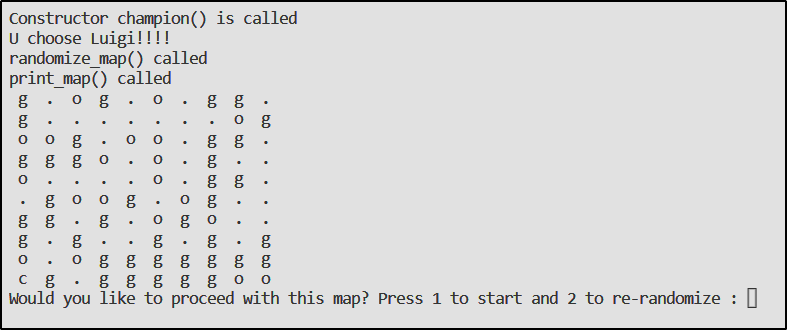
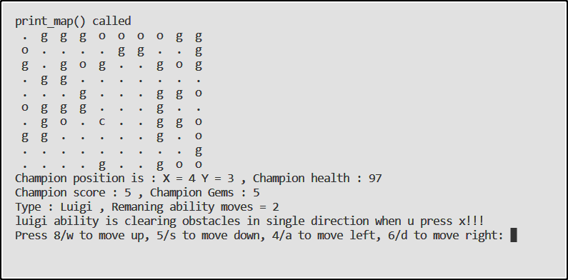

<html>
<h1>Super Mario</h1>
     
    <h2>
    Table of contents
    </h2>
    <h3> 
        <ul>
            <li>Project Title</li>
            <li>Table of contents</li>
            <li>Description</li>
            <li>Demo-Preview</li>
        </ul>
    </h3>
     
    <h2>Description</h2>
    <h3>In this mini game you can choose from 2 characters either Mario or luigi each having a special ability, then u can randomize a map to play in, The goal of the game is to collect all the Gems in the map while avoiding obstacles.</h3>
     

   

</html>
